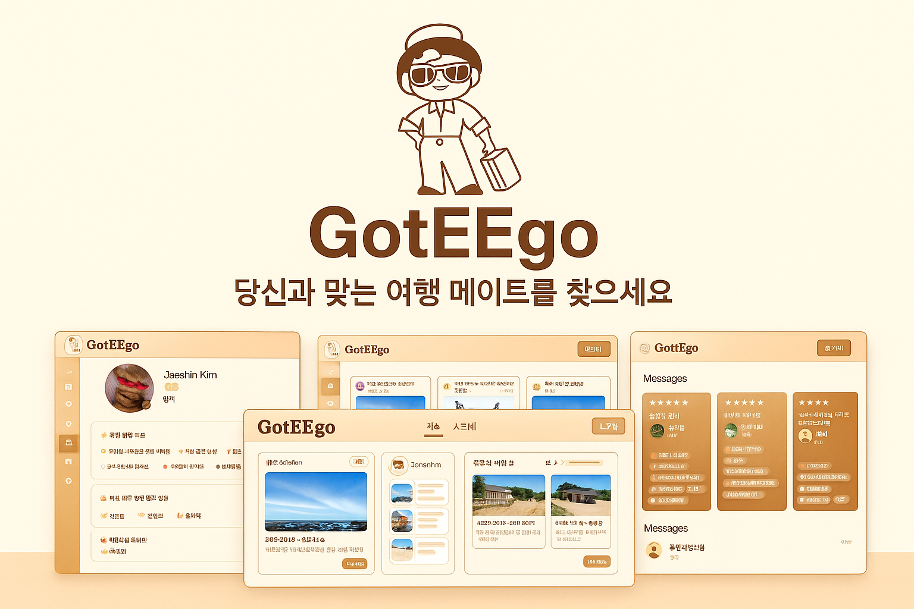
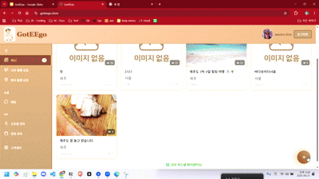
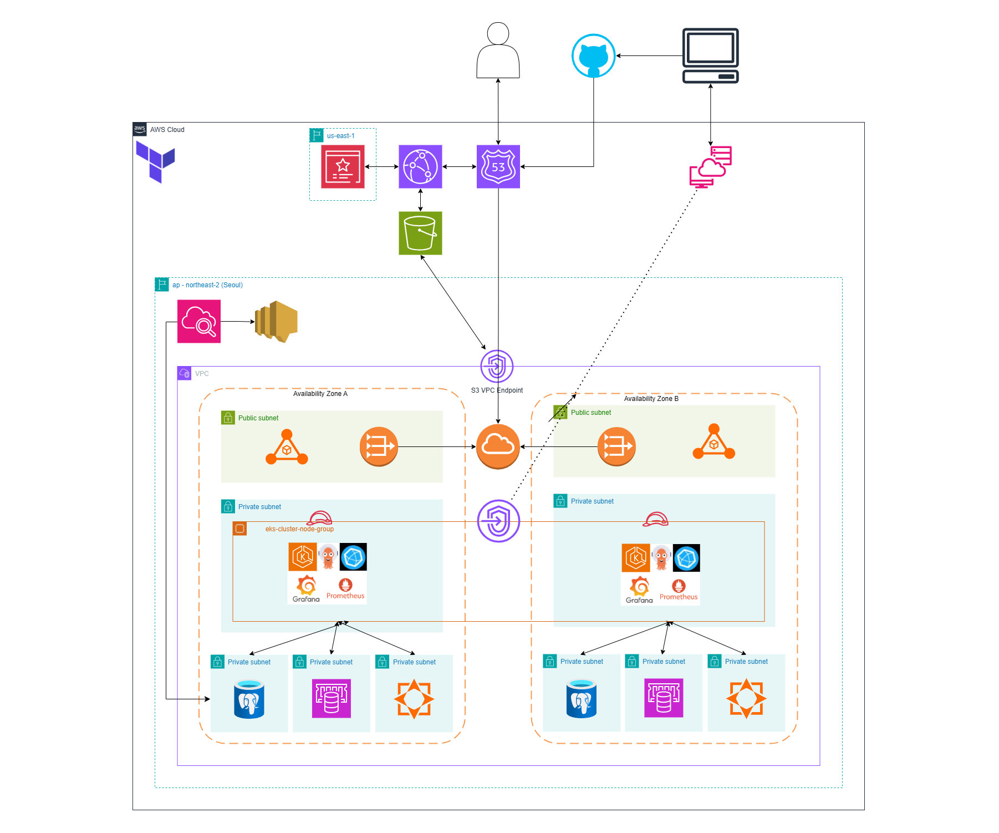

# ✈️ GotEEgo 

<h3 style="margin-top: 0;">🌏 사용자 맞춤 여행 메이트 추천 플랫폼</h3>

  
   
   
  
  &nbsp; 
  
  &nbsp;
  

---

## 📋 프로젝트 개요
### **"나를 찾는 여행, GotEEgo"**

 여행자들은 넘쳐나는 정보 속에서 **자신에게 딱 맞는 여행지**를 찾기 어려워하고, 여행의 소중한 순간들을 기록하고 공유할 통합된 공간을 필요로 합니다. **GotEEgo**는 여행 기록(Feed)과 실시간 소통(Chat)을 결합하고, **사용자 성향을 분석**한 맞춤형 여행지 추천을 제공하는 올인원 여행 플랫폼입니다.

---

## 🎯 앱 주요 기능

### 1. 여행 피드 (Feed)

  [피드 목록 사진 첨부]
  [피드 상세 사진 첨부]

* **여행 기록 & 공유**: 텍스트와 이미지(S3)를 포함한 여행기를 작성하고 공유합니다.
* **상호작용**: 좋아요, 댓글 기능을 통해 다른 여행자들과 경험을 나눕니다.
* **필터링 & 검색**: 지역(Region), 태그 등을 기반으로 원하는 여행 정보를 손쉽게 탐색할 수 있습니다.

### 2. 개인화 추천 시스템 (Recommendation)

  

* **유사 여행지 추천**: PostgreSQL의 `pgvector` 확장을 활용하여 사용자의 활동 데이터와 여행지 특성 간의 벡터 유사도(Cosine Similarity)를 계산, 취향에 맞는 여행지를 정교하게 추천합니다.
* **사용자 기반 추천**: 나와 여행 스타일이 비슷한 사용자를 찾아주어 새로운 여행 영감을 제공합니다.

### 3. 실시간 채팅 (Chat)

  [채팅 화면 사진 첨부]

* **실시간 소통**: WebSocket과 STOMP 프로토콜을 활용하여 여행 동행 구하기나 정보 공유를 위한 지연 없는 대화 환경을 제공합니다.
* **대용량 메시지 저장**: 빈번하게 발생하는 채팅 데이터를 효율적으로 처리하기 위해 MongoDB(Amazon DocumentDB)를 사용하여 채팅 내역을 영구 저장합니다.

### 4. 인증 및 보안 (Authentication)

  [로그인 화면 사진 첨부]

* **소셜 로그인**: Google OAuth2를 연동하여 복잡한 가입 절차 없이 간편하게 서비스를 이용할 수 있습니다.
* **JWT 보안**: Access Token과 Refresh Token(Redis 저장)을 활용한 이중 토큰 방식으로 보안성과 사용자 편의성을 모두 확보했습니다.

### 5. 배지 시스템 (Gamification)

  [배지/마이페이지 화면 사진 첨부]

* **활동 보상**: 피드 작성, 댓글, 여행지 방문 등 다양한 활동에 따라 배지를 부여하여 사용자의 지속적인 참여를 유도합니다.

---

## 🏗️ 시스템 아키텍처

GotEEgo는 **AWS Cloud** 환경 위에서 **EKS(Kubernetes)** 를 활용한 클라우드 네이티브 아키텍처로 설계되었습니다.

    

### ☁️ Infrastructure & Deployment

#### 1. Cloud Native Environment (AWS EKS)
* **AWS EKS**를 사용하여 컨테이너 오케스트레이션 환경을 구축했습니다.
* **Terraform**을 이용한 IaC(Infrastructure as Code)로 VPC, EKS, RDS 등 모든 인프라 리소스를 코드로 관리하고 프로비저닝하여 환경 일관성을 보장합니다.

#### 2. GitOps Workflow (ArgoCD)
* **GitHub Actions**로 CI(빌드/테스트/이미지 푸시)를 수행하고, **ArgoCD**가 Manifest 리포지토리를 감시하여 EKS 클러스터에 변경 사항을 자동으로 배포(CD)합니다.

#### 3. Polyglot Persistence
데이터의 특성에 맞는 최적의 저장소를 선택하여 사용합니다.
* **PostgreSQL (RDS)**: 사용자, 피드 등 관계형 데이터 및 `pgvector`를 이용한 벡터 데이터 저장.
* **MongoDB (DocumentDB)**: 비정형 대용량 데이터인 채팅 로그 저장.
* **Redis (ElastiCache)**: 세션 관리(Refresh Token) 및 캐싱을 통한 성능 최적화.

---

## 🛠️ 기술 스택

| Category | Technology |
| :--- | :--- |
| **Backend** |      |
| **Database** |    |
| **Cloud & Infra** |     |
| **DevOps** |     |
| **Storage** |  |

---

## 🚀 고도화 구현 기술

> 본 프로젝트의 주요 고도화 구현 기술을 요약합니다.

### 1. Vector Search 기반 추천 시스템
- **문제:** 단순 키워드 검색이나 필터링으로는 사용자의 복합적인 취향을 반영한 여행지 추천에 한계가 있음.
- **해결:** **PostgreSQL의 `pgvector` 확장**을 도입. 여행지의 특징과 사용자의 선호 데이터를 고차원 벡터로 변환(Embedding)하여 저장.
- **효과:** Cosine Similarity(코사인 유사도) 연산을 통해 사용자의 취향과 가장 유사한 여행지를 실시간으로 추천.

### 2. Hybrid DB Architecture (Polyglot Persistence)
- **문제:** 채팅 기능 도입 시, 단일 RDB로 모든 트래픽을 감당하기엔 I/O 부하가 크고 스키마 유연성이 떨어짐.
- **해결:** 데이터 성격에 따라 저장소를 분리.
  - **Transaction:** 사용자, 결제, 피드 등 정합성이 중요한 데이터는 `PostgreSQL`.
  - **Chat Log:** 쓰기 작업이 빈번하고 데이터 구조가 가변적인 채팅 내역은 `MongoDB`.
  - **Session/Cache:** 빠른 접근이 필요한 토큰 및 임시 데이터는 `Redis`.
- **성과:** 각 DB의 장점을 활용하여 시스템 전체의 성능과 안정성 확보.

### 3. Infrastructure as Code (Terraform)
- **문제:** 복잡한 클라우드 리소스(VPC, Subnet, EKS, RDS 등)를 콘솔에서 수동으로 관리 시 휴먼 에러 발생 위험.
- **해결:** **Terraform**을 사용하여 인프라 전체를 코드로 정의하고 모듈화.
- **효과:** 인프라 생성 및 변경 이력을 버전 관리 시스템으로 추적 가능하며, 동일한 환경을 손쉽게 복제/재생성 가능.

### 서비스 상세 문서

| 서비스 명 | 역할 및 주요 기술 | 상세 문서 |
|:---:|:---|:---:|
| **Feed API** | • 여행기 CRUD, 이미지 업로드, 검색 | [API 명세서](API_TEST_SCENARIOS.md) |
| **Chat API** | • WebSocket, STOMP, MongoDB 연동 | TBD |
| **Recommendation** | • pgvector 유사도 계산, 사용자 임베딩 | TBD |
| **Infra** | • Terraform 모듈 및 EKS 설정 | [Infra Repo 바로가기]([인프라 레포 링크]) |

---

## 🔥 트러블 슈팅 (Troubleshooting)

> 개발 과정에서 마주친 주요 기술적 난관과 해결 과정을 기록했습니다.

### 주요 트러블 슈팅 사례

| 주제 | 이슈 및 해결 요약 | 상세 내용 |
|:---:|:---|:---:|
| **Vector DB** | • **차원 불일치**: 임베딩 벡터 생성 시 차원 수 불일치로 인한 검색 오류 해결 | [링크] |
| **WebSocket** | • **Session 관리**: 로드밸런서 환경에서 WebSocket 연결 끊김 및 세션 유지 문제 해결 | [링크] |
| **JPA/DB** | • **N+1 문제**: 피드 목록 조회 시 연관된 태그/댓글 조회 성능 이슈를 `BatchSize` 및 `Fetch Join`으로 해결 | [링크] |
| **Infra** | • **Ingress 라우팅**: AWS ALB Ingress Controller 설정 시 경로 매핑 오류 디버깅 | [링크] |

---

## 👥 팀원 구성 및 역할

<table>
  <tr>
    <td align="center" width="25%">
      
       
      <h3>[팀원1 이름]</h3>
    </td>
    <td align="center" width="25%">
      
       
      <h3>[팀원2 이름]</h3>
    </td>
    <td align="center" width="25%">
      
       
      <h3>[팀원3 이름]</h3>
    </td>
    <td align="center" width="25%">
      
       
      <h3>[팀원4 이름]</h3>
    </td>
  </tr>
  <tr>
    <td valign="top">
      <b>🛠 Role</b> 
      - Backend Lead 
      - Infra (Terraform) 
      - CI/CD Setup
    </td>
    <td valign="top">
      <b>💻 Role</b> 
      - Feed Service 
      - Recommendation Logic 
      - API Development
    </td>
    <td valign="top">
      <b>🎨 Role</b> 
      - Frontend Lead 
      - UI/UX Design 
      - State Management
    </td>
    <td valign="top">
      <b>💬 Role</b> 
      - Chat Service 
      - WebSocket Handler 
      - MongoDB Integration
    </td>
  </tr>
</table>