# ✈️ GotEEgo 

<h3 style="margin-top: 0;">🌏 사용자 맞춤 여행 메이트 추천 플랫폼</h3>

  
   
   
  
  &nbsp; 
  
  &nbsp;
  

---

## 📋 프로젝트 개요
### **"나를 찾는 여행, GotEEgo"**

 여행자들은 넘쳐나는 정보 속에서 **자신에게 딱 맞는 여행지**를 찾기 어려워하고, 여행의 소중한 순간들을 기록하고 공유할 통합된 공간을 필요로 합니다. **GotEEgo**는 여행 기록(Feed)과 실시간 소통(Chat)을 결합하고, **사용자 성향을 분석**한 맞춤형 여행지 추천을 제공하는 올인원 여행 플랫폼입니다.

---

## 🎯 앱 주요 기능

### 1. 사전 동행 모집

  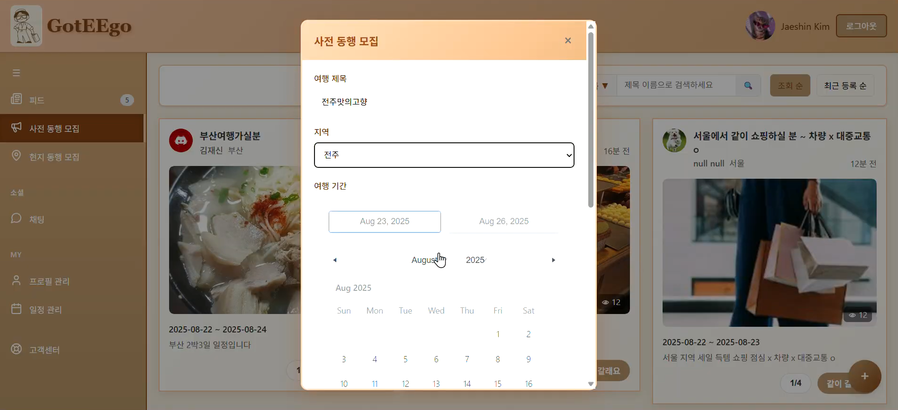
  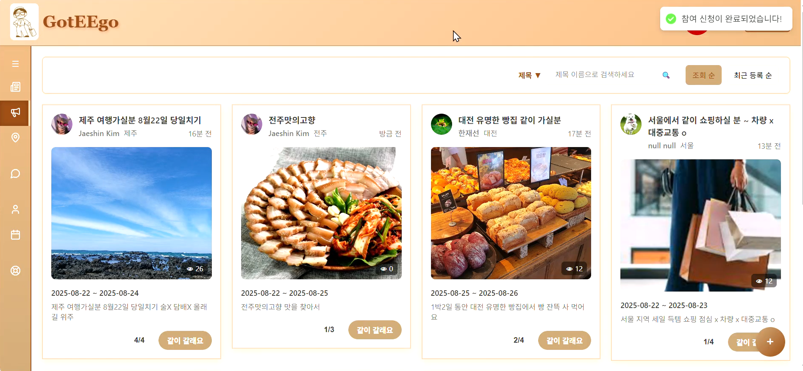

* **사전 동행 (BEFORE)**: 출발 전, 상세 일정과 경로를 계획하여 동행을 모집합니다. 게시글 생성 시 전용 그룹 채팅방이 자동으로 생성됩니다.
* **개인화 맞춤 정렬**: **User Embedding**과 **Vector Similarity(Cosine)** 기술을 활용하여 나와 여행 스타일이 가장 잘 맞는 동행 모집글을 우선적으로 추천합니다.

### 2. 현지 동행 모집 

  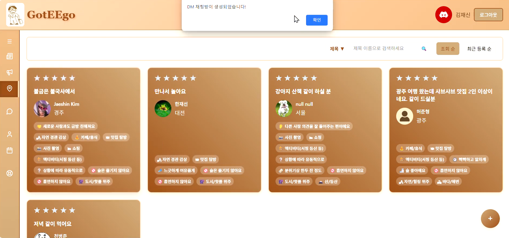
  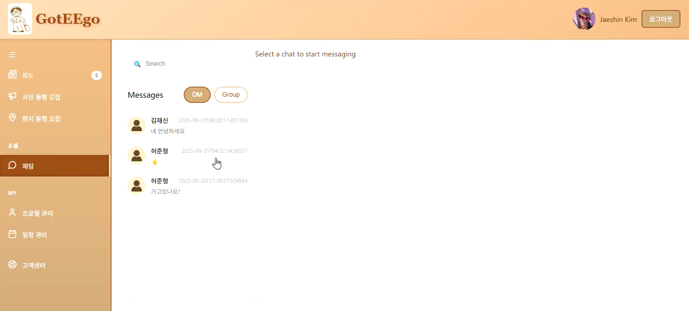

* **현지 번개 (NOW)**: 여행지 현지에서 식사나 투어를 함께할 동행을 즉흥적이고 빠르게 모집합니다. 게시글 클릭 시, 1:1 채팅방(DM)이 자동으로 생성됩니다.

### 3. 일정 및 참여자 관리

  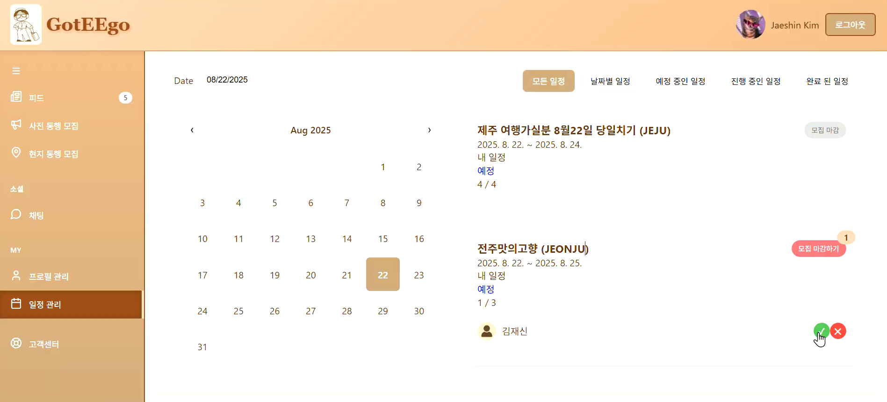
  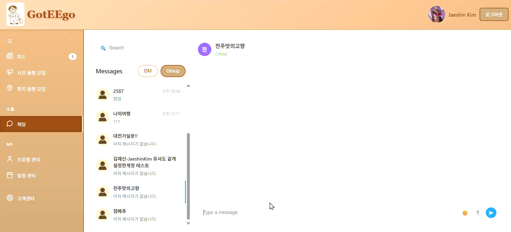

* **참여자 승인 프로세스**: 작성자는 신청자의 프로필을 검토하여 `승인(APPROVED)` 또는 `거절(REJECTED)`할 수 있으며, 승인된 인원은 자동으로 채팅방에 초대됩니다.
* **자동화된 상태 관리**: 모집 인원 달성 시 자동 마감 처리되며, 여행 날짜에 따라 일정 상태(예정/진행 중/종료)가 시스템에 의해 자동으로 갱신됩니다.

### 4. 실시간 채팅 (Chat)

  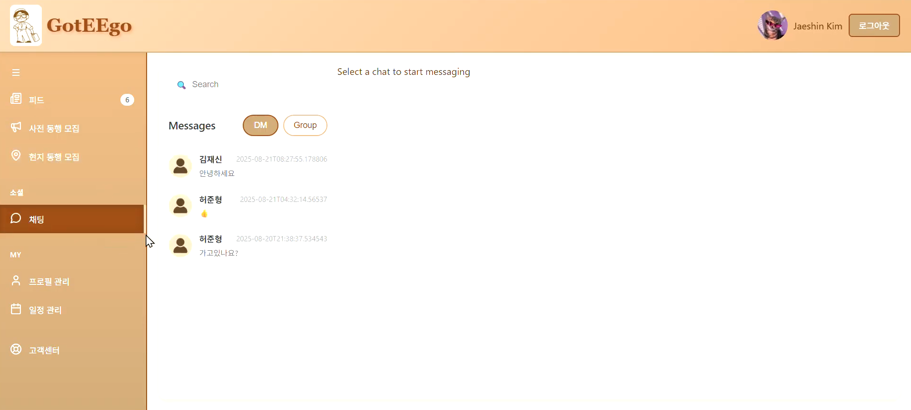
  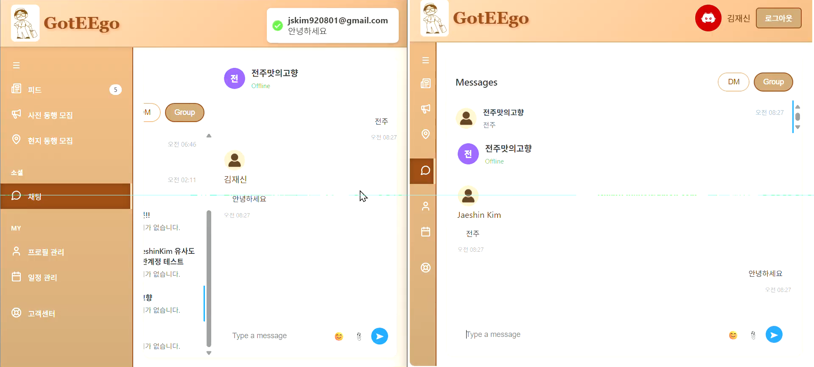

* **실시간 소통**: WebSocket과 STOMP 프로토콜을 활용하여 여행 동행 구하기나 정보 공유를 위한 지연 없는 대화 환경을 제공합니다.
* **대용량 메시지 저장**: 빈번하게 발생하는 채팅 데이터를 효율적으로 처리하기 위해 MongoDB(Amazon DocumentDB)를 사용하여 채팅 내역을 영구 저장합니다.

### 5. 여행 피드 (Feed)

  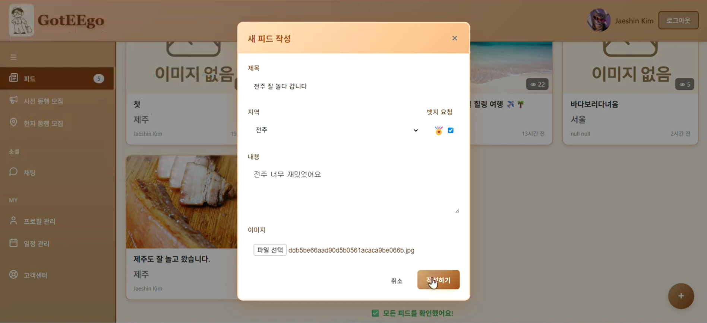
  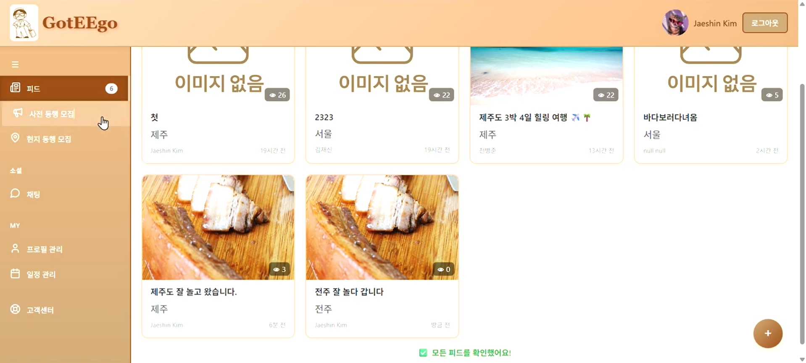

* **여행 기록 & 공유**: 텍스트와 이미지(S3)를 포함한 여행기를 작성하고 공유합니다.
* **상호작용**: 좋아요, 댓글 기능을 통해 다른 여행자들과 경험을 나눕니다.
* **필터링 & 검색**: 지역(Region), 태그 등을 기반으로 원하는 여행 정보를 손쉽게 탐색할 수 있습니다.

### 6. 인증 및 보안 (Authentication)

  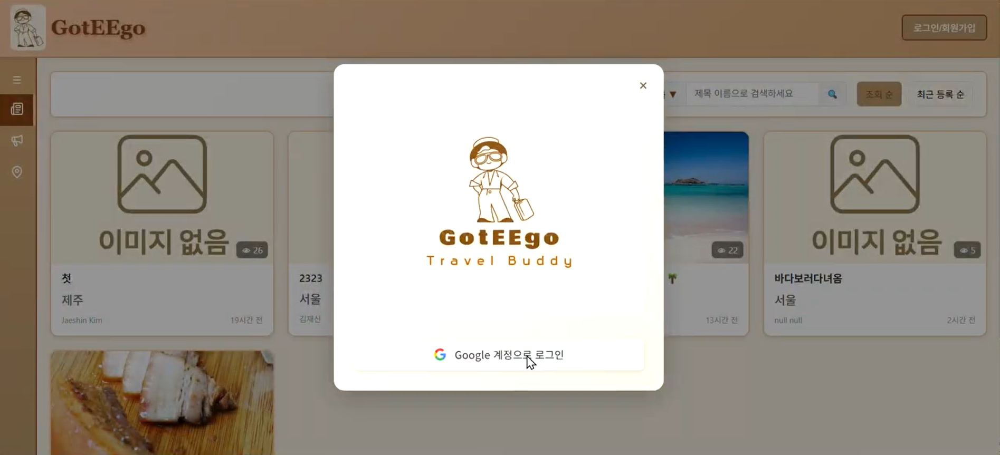

* **소셜 로그인**: Google OAuth2를 연동하여 복잡한 가입 절차 없이 간편하게 서비스를 이용할 수 있습니다.
* **JWT 보안**: Access Token과 Refresh Token(Redis 저장)을 활용한 이중 토큰 방식으로 보안성과 사용자 편의성을 모두 확보했습니다.

### 7. 배지 시스템 (Gamification)

  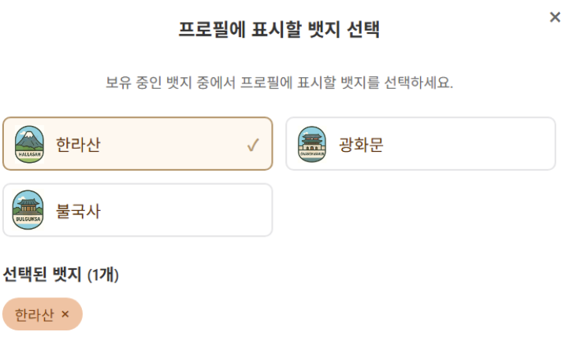

* **활동 보상**: 피드 작성, 댓글, 여행지 방문 등 다양한 활동에 따라 배지를 부여하여 사용자의 지속적인 참여를 유도합니다.

---

## 🏗️ 시스템 아키텍처

GotEEgo는 **AWS Cloud** 환경 위에서 **EKS(Kubernetes)** 를 활용한 클라우드 네이티브 아키텍처로 설계되었습니다.

    

### ☁️ Infrastructure & Deployment

#### 1. Cloud Native Environment (AWS EKS)
* **AWS EKS**를 사용하여 컨테이너 오케스트레이션 환경을 구축했습니다.
* **Terraform**을 이용한 IaC(Infrastructure as Code)로 VPC, EKS, RDS 등 모든 인프라 리소스를 코드로 관리하고 프로비저닝하여 환경 일관성을 보장합니다.

#### 2. GitOps Workflow (ArgoCD)
* **GitHub Actions**로 CI(빌드/테스트/이미지 푸시)를 수행하고, **ArgoCD**가 Manifest 리포지토리를 감시하여 EKS 클러스터에 변경 사항을 자동으로 배포(CD)합니다.

#### 3. Polyglot Persistence
데이터의 특성에 맞는 최적의 저장소를 선택하여 사용합니다.
* **PostgreSQL (RDS)**: 사용자, 피드 등 관계형 데이터 및 `pgvector`를 이용한 벡터 데이터 저장.
* **MongoDB (DocumentDB)**: 비정형 대용량 데이터인 채팅 로그 저장.
* **Redis (ElastiCache)**: 세션 관리(Refresh Token) 및 캐싱을 통한 성능 최적화.

---

## 🛠️ 기술 스택

| Category | Technology |
| :--- | :--- |
| **Backend** |      |
| **Database** |    |
| **Cloud & Infra** |     |
| **DevOps** |     |
| **Storage** |  |

---

## 📊 시스템 모니터링 (Monitoring)

**Prometheus**와 **Grafana**를 연동하여 EKS 클러스터와 애플리케이션의 상태를 실시간으로 시각화하고, 안정적인 서비스 운영 환경을 구축했습니다.

  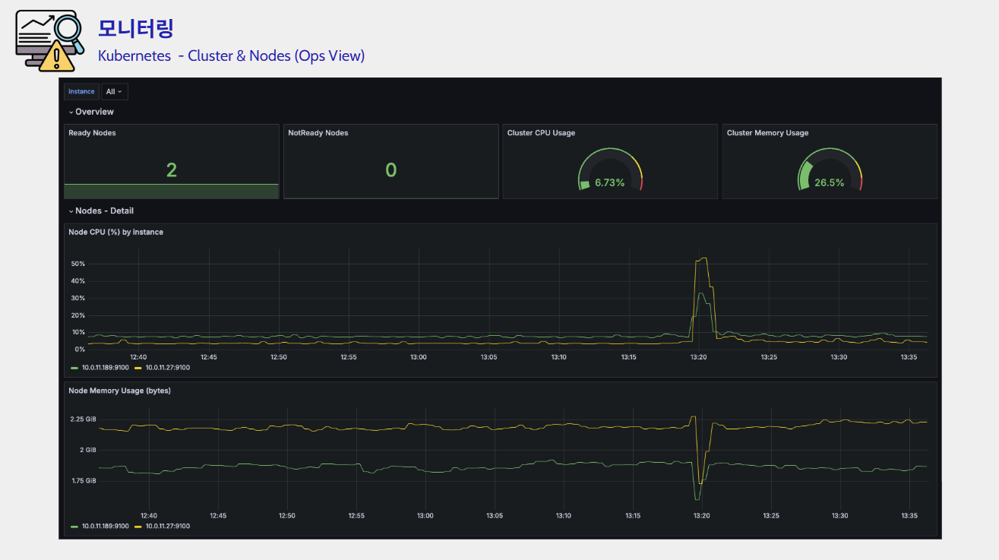
  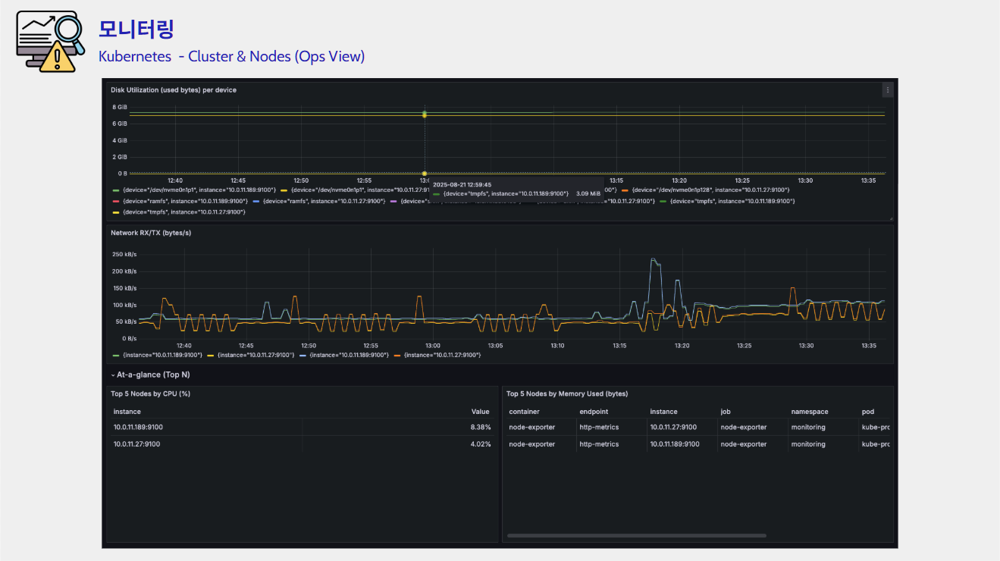
   
  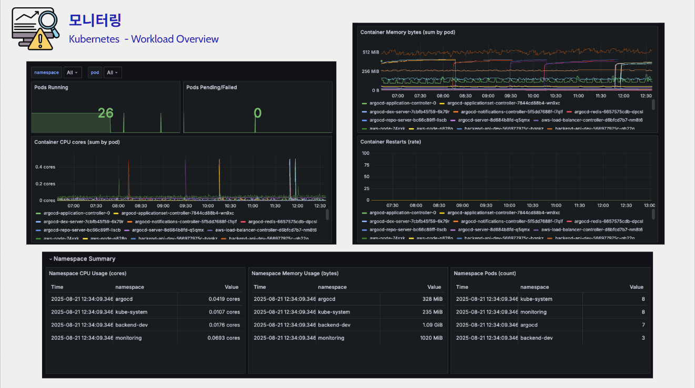
  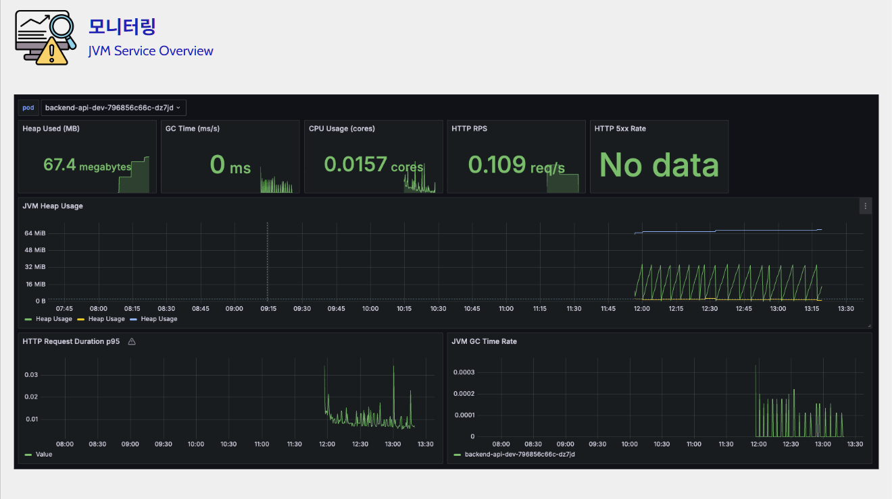

* **Cluster & Node Monitoring**: 쿠버네티스 클러스터의 전반적인 건강 상태와 각 노드의 CPU/Memory 리소스 사용량을 추적하여 오토스케일링(HPA/CA) 지표로 활용합니다.
* **Workload Status**: 배포된 파드(Pod)들의 실행 상태, 리스타트 횟수, 네트워크 트래픽을 모니터링하여 이슈 발생 시 신속하게 감지합니다.
* **JVM Insights**: Spring Boot 애플리케이션의 Heap Memory, Garbage Collection(GC), Thread 상태를 상세하게 모니터링하여 메모리 누수 및 성능 저하를 방지합니다.

---

## 🚀 고도화 구현 기술

> 본 프로젝트의 주요 고도화 구현 기술을 요약합니다.

### 1. Vector Search 기반 추천 시스템
- **문제:** 단순 키워드 매칭이나 필터링만으로는 사용자의 복합적인 여행 취향과 스타일을 반영한 정교한 추천이 어려움.
- **해결:** **PostgreSQL의 `pgvector` 확장**을 도입하여 사용자의 활동 데이터와 여행지 특성을 고차원 벡터로 변환(Embedding)하여 저장.
- **효과:** Cosine Similarity(코사인 유사도) 연산을 통해 사용자의 성향과 벡터 거리가 가장 가까운 여행 메이트를 실시간으로 추천하여 매칭 정확도 향상.

### 2. Redis 기반 성능 최적화 (Write-Back & Pub/Sub)
- **문제:** 1. 게시글 조회 시마다 DB 업데이트(Update Query)가 발생하여 I/O 부하 증가.
  2. 다중 서버 환경 확장 시 웹소켓 세션 간 메시지 동기화 문제 발생 가능성.
- **해결:**
  - **Write-Back 전략**: 조회수를 Redis `AtomicLong`으로 실시간 증가시키고, 일정 횟수(예: 10회) 도달 시에만 DB에 일괄 반영(Flush)하여 쓰기 연산 최소화.
  - **Redis Pub/Sub**: 채팅 메시지 발행과 구독을 Redis 채널로 분리하여, 채팅 서버 간 메시지 브로드캐스팅이 가능한 확장성 있는 구조 설계.
- **성과:** 데이터베이스 부하를 획기적으로 줄이고, 실시간 채팅 서비스의 확장성(Scalability) 확보.

### 3. Hybrid DB Architecture (Polyglot Persistence)
- **문제:** 채팅 서비스 특성상 빈번한 쓰기 작업과 가변적인 데이터 구조를 단일 RDB로 처리하기에는 비효율적임.
- **해결:** 데이터의 성격(Data Gravity)에 맞춰 최적의 저장소를 분리하여 사용.
  - **PostgreSQL (RDB):** 사용자, 여행 게시글 등 트랜잭션 보장과 관계 정의가 중요한 정형 데이터.
  - **MongoDB (NoSQL):** 스키마가 유연하고 대용량 쓰기 처리에 유리한 채팅 로그 데이터.
  - **Redis (In-Memory):** 빠른 액세스가 필요한 Refresh Token 저장 및 조회수 캐싱.
- **성과:** 각 데이터베이스의 강점을 활용하여 시스템 전체의 안정성과 처리량(Throughput) 극대화.

## 🔥 트러블 슈팅 (Troubleshooting)

프로젝트 개발 과정에서 마주친 주요 기술적 난관과 해결 과정을 기록했습니다.

<b>1. WebSocket 연결 시 HttpOnly 쿠키(JWT) 인식 불가 문제</b>

### ❌ 문제 상황
- **현상:** 클라이언트(JS)에서 `SockJS`를 통해 STOMP 연결(`CONNECT`)을 시도할 때, 서버가 클라이언트의 쿠키에 담긴 JWT를 인식하지 못해 연결이 거부됨(Null 반환).
- **원인:** 1. STOMP 프로토콜 자체는 HTTP 헤더인 쿠키(Cookie) 전달을 기본적으로 지원하지 않음.
  2. 보안 요건상 JWT를 `HttpOnly` 쿠키로 관리하고 있어, JS에서 토큰을 직접 꺼내 STOMP 헤더(`Authorization`)에 담는 우회 방식 사용 불가.

### 💡 해결 방안
**HTTP와 STOMP의 계층 차이를 이용한 데이터 전달**

1. **Handshake Interceptor 활용:** - WebSocket 연결 전 일어나는 HTTP Handshake 과정(`Interceptors`)을 가로챔.
  - 이때 HTTP 요청의 쿠키에서 JWT를 추출하여 WebSocket 세션 속성(`attributes`)에 저장.
2. **StompHandler 연동:**
  - 실제 메시징이 일어나는 `StompHandler`에서 WebSocket 세션에 저장해둔 토큰 값을 꺼내와 유저 정보(`Principal`)를 설정.
3. **확장성 고려 (Redis Ticket):**
  - 다중 서버 환경(ALB)에서 핸드셰이크와 STOMP 연결 요청이 서로 다른 서버로 분산될 위험이 있음.
  - 이를 방지하기 위해 Handshake 시점에 **Redis에 30초짜리 단기 티켓**을 발급하고, STOMP 연결 시 이 티켓을 검증하는 방식으로 무중단 연결을 보장.

<b>2. 다중 서버(EKS) 환경에서의 실시간 메시지 동기화 문제</b>

### ❌ 문제 상황
- **현상:** 서버가 여러 대인 EKS 환경에서, **Server A**에 접속한 유저가 **Server B**에 접속한 유저에게 메시지를 보내면 전달되지 않음.
- **원인:** STOMP의 `Topic`은 각 서버의 메모리(In-Memory) 내에서만 관리됨. 다른 서버에 있는 구독자(Subscriber) 정보나 채널 발행 사실을 알 수 없음.

### 💡 해결 방안
**Redis Pub/Sub을 활용한 메시지 브로드캐스팅**

1. **구조 변경:** - 기존 `SimpMessagingTemplate`을 이용한 단일 서버 전송 방식을 제거.
  - **Redis**를 메시지 브로커(중앙 채널 공유 서버)로 도입.
2. **Pub/Sub 구현:**
  - **Publisher:** 메시지 발생 시 Redis의 특정 토픽으로 메시지 발행 (`convertAndSend`).
  - **Subscriber:** 모든 서버가 Redis 토픽을 구독(`MessageListener`)하고 있다가, 메시지가 오면 자신의 서버에 연결된 해당 유저에게 WebSocket으로 메시지 전달.
3. **전용 DTO 분리:**
  - Redis 전송 규격에 맞춘 `DirectMessageTransferDto`, `NotificationTransferDto`를 신규 설계하여 직렬화/역직렬화 이슈 해결.

<b>3. 멀티 서버 환경에서 Google OAuth2 로그인 실패 이슈</b>

### ❌ 문제 상황
- **현상:** 다중 서버 환경에서 소셜 로그인 진행 시, `redirect_uri`로 돌아왔을 때 인증 요청을 보냈던 서버와 응답을 받는 서버가 달라 로그인 처리가 실패함.
- **원인:** OAuth2 인증 과정에서 생성되는 임시 상태 정보(Authorization Request 등)가 세션에 저장되는데, 서버 간 세션 동기화가 되어있지 않음.

### 💡 해결 방안
**로그인 프로세스 한정 Redis Session 도입**

1. **하이브리드 세션 전략:**
  - 서비스 전체는 **JWT 기반의 Stateless 아키텍처**를 유지하여 확장성을 확보.
  - 오직 **로그인(인증) 과정**에서만 **Redis**를 세션 저장소로 사용하여 서버 간 인증 상태를 공유.
2. **선정 이유:**
  - OAuth2 흐름 특성상 리다이렉트가 필수적이므로 상태 공유가 반드시 필요함.
  - Redis는 속도가 빠르고 TTL(만료 시간) 설정이 용이하여, 짧은 시간 동안만 유지되어야 하는 로그인 세션 관리에 최적합.

## 👥 팀원 구성 및 역할

<table>
  <tr>
    <td align="center" width="25%">
      
      <h3 style="margin-top: 10px;">김재신(팀장)</h3>
    </td>
    <td align="center" width="25%">
      
      <h3 style="margin-top: 10px;">천병준(부팀장)</h3>
    </td>
    <td align="center" width="25%">
      
      <h3 style="margin-top: 10px;">허준형(팀원)</h3>
    </td>
    <td align="center" width="25%">
      
      <h3 style="margin-top: 10px;">임현주(팀원)</h3>
    </td>
  </tr>
  <tr>
    <td valign="top">
      <b>☁️ Infra & Core</b> 
      - AWS (VPC, EKS, ALB) 
      - ArgoCD Setup 
      - Vector Recommendation
    </td>
    <td valign="top">
      <b>🖥️ Frontend & Auth</b> 
      - UI Development 
      - Monitoring Setup 
      - Auth (Login/Join)
    </td>
    <td valign="top">
      <b>💾 Backend Main</b> 
      - Chat, Feed, Schedule 
      - Data Modeling 
      - ArgoCD Support
    </td>
    <td valign="top">
      <b>☁️ Backend & Infra</b> 
      - AWS (RDS, Redis) 
      - HPA Configuration 
      - Badge & Review API
    </td>
  </tr>
</table>